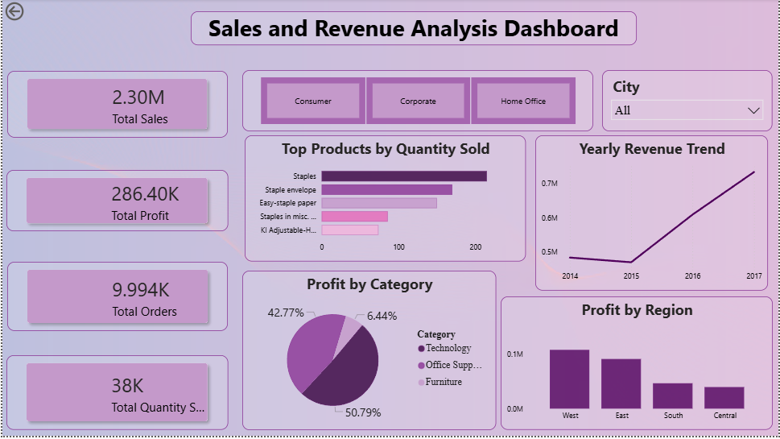

# Sales & Revenue Analysis Dashboard
This is my first github repository

## Project Overview

This project is a Sales & Revenue Analysis Dashboard created using Power BI. The dashboard helps analyze sales performance, revenue trends, profit distribution, and top-performing products through interactive visualizations.

## Objective

The main objective of this project is to:

* Analyze sales and revenue data
* Track important KPIs
* Generate business insights
* Create interactive visualizations for better decision-making

## Tools Used

* CSV Dataset
* Power BI

## Dashboard Features

* KPI Cards for Total Sales, Profit, Quantity, and Orders
* Revenue Trend Analysis
* Top Products by Quantity Sold
* Profit Analysis by Region
* Profit Distribution by Category
* Interactive City Filter/Slicer

## Key Insights

* Revenue trends show business growth over time.
* Some regions contribute more profit compared to others.
* Interactive filters help analyze data city-wise.

## Files Included

* Power BI Dashboard File 
* Dataset File
* Dashboard Screenshot
* README.md

## Dashboard Preview

## Conclusion

This dashboard provides a clear understanding of sales and revenue performance using interactive charts and KPI tracking. It helps in identifying trends, profitable regions, and top-performing products.

---

This project was developed as part of a Data Analyst Internship Task.

